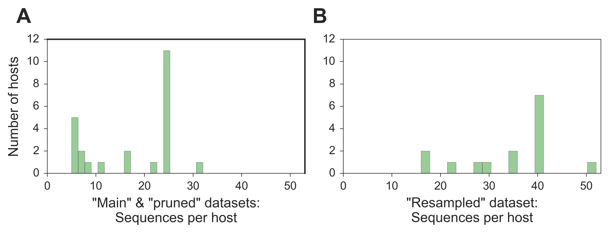

# Datasets

* [Host metadata](hosts/)
* ["Main" sequence dataset](main/)
* ["Supplemental" sequence dataset](supplemental/)  
    
  
  
_Lentiviral genomes are translated in multiple reading frames; we therefore utilized nucleotide sequence data for all analyses._  
  
###Main & Supplemental Datasets
Primate lentiviral sequences were downloaded from the comprehensive [LANL HIV sequence database](https://www.hiv.lanl.gov/content/sequence/HIV/mainpage.html). Sequences from strains known to be the result of artificial cross-species transmissions (SIVmac, -stm, -mne, and –wcm) were excluded. We also excluded any sequences shorter than 500 bases or that were flagged as problematic by [standard LANL criteria](https://www.hiv.lanl.gov/components/sequence/HIV/search/help.html#output). We grouped host subspecies together except for cases where there is a known specific relationship between host subspecies and virus strain (chimpanzees and African green monkeys). To construct datasets with a more equitable distribution of sequences per host, we preferentially subsampled sequences from the LANL Compendium, followed by samples isolated from Africa (more likely to be primary sequences), and finally supplementing with samples isolated elsewhere (excluding experimentally generated sequences). For humans, mandrils and mustached monkeys, which are host to 2, 2 and 3 distinct viral lineages, respectively, we allowed a few additional sequences (if available) to represent the full breadth of documented lentiviral diversity. The “main” dataset consists of 24 host species, with 5-25 sequences per viral lineage (total N=422). As an alternative dataset to control for sampling bias and data availability, we also constructed a “supplemental” dataset with just 15 hosts but with more viral sequences per host (16 – 40 sequences per lineage, N=510). 

###Alignments
Alignments were done with the L-INSI algorithm implemented in mafft v7.294b; the Compendium alignment was held fixed, with other sequences aligned to this template. Insertions relative to the fixed compendium were discarded. This alignment was then split along the breakpoints identified by GARD to yield the segment-specific alignments. 

