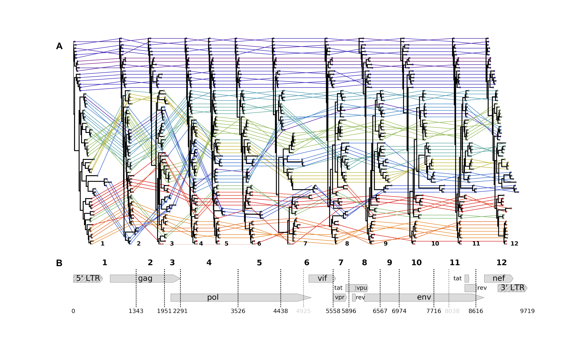
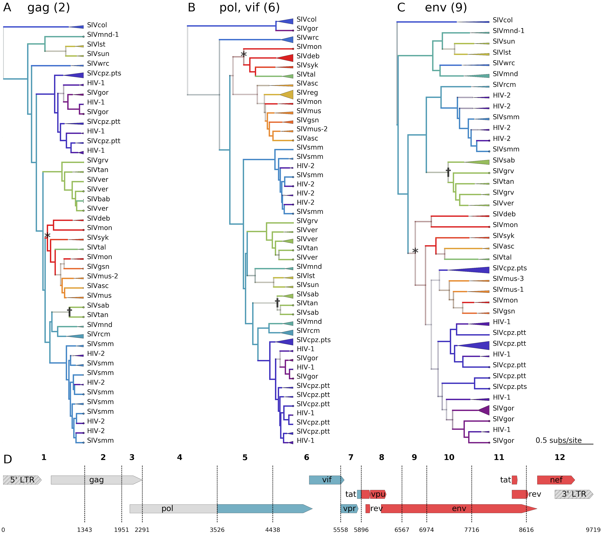
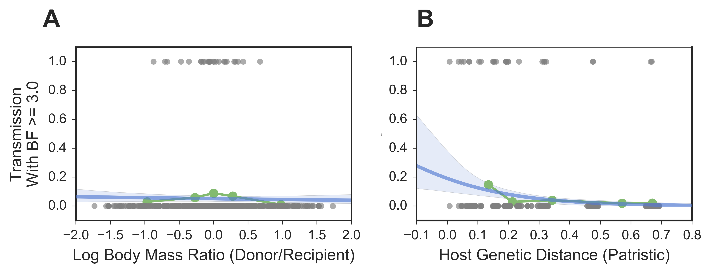

  
###Figure 1: There have been at least 13 interlineage recombination events among SIVs.  
The SIV LANL compendium, slightly modified to reduce overrepresentation of HIV, was analyzed with GARD to identify the 13 recombination breakpoints across the genome (dashed lines in B; numbering according to the accepted HXB2 reference genome--accession K03455, illustrated). Two of these breakpoints were omitted from further analyses because they created extremely short fragments (< 500 bases; gray dashes in **B**). For each of the 11 remaining breakpoints used in further analyses, we split the compendium alignment along these breakpoints and built a maximum likelihood tree, displayed in **(A)**. Each viral sequence is color-coded by host species, and its phylogenetic position is traced between trees. Heuristically, straight, horizontal colored lines indicate congruent topological positions between trees (likely not a recombinant sequence); criss-crossing colored lines indicate incongruent topological positions between trees (likely a recombinant sequence).  

  
###Figure 2: Cross-species transmissions are inferred from tree topologies; SIVcpz has mosaic origins.  
A,B,C - Bayesian maximum clade credibility (mcc) trees are displayed for segments 2 (gag - A), 6 (int and vif - B), and 9 (env – C) of the main dataset (N=423). Tips are color coded by known host species; internal nodes and branches are colored by inferred host species, with saturation indicating the confidence of these assignments. Monophyletic clades of viruses from the same lineage are collapsed, with the triangle width proportional to the number of represented sequences. An example of likely cross-species transmission is starred in each tree, where the host state at the internal node (red / mona monkeys) is incongruent with the descendent tips' known host state (green / talapoin monkeys), providing evidence for a transmission from mona monkeys to talapoin monkeys. Another example of cross-species transmission of a recombinant virus among African green monkeys is marked with a dagger.  
D - The genome map of SIVcpz, with breakpoints used for the discrete trait analysis, is color coded and labeled by the most likely ancestral host for each segment of the genome.

###Figure 3: Most lentiviruses are the product of ancient cross-species transmissions.  
The phylogeny of the host species' mitochondrial genomes forms the outer circle. Arrows represent transmission events inferred by the model with Bayes' factor (BF) >= 3.0; black arrows have BF >= 10, with opacity of gray arrows scaled for BF between 3.0 and 10.0. Width of the arrow indicates the rate of transmission (actual rates = rates * indicators). Circle sizes represent network centrality scores for each host. Transmissions from chimps to humans; chimps to gorillas; gorillas to humans; sooty mangabeys to humans; sabaeus to tantalus; and vervets to baboons have been previously documented. To our knowledge, all other transmissions illustrated are novel identifications.

###Figure 4: Cross-species transmission is driven by exposure and constrained by host genetic distance.  
For each pair of host species, we (A) calculated the log ratio of their average body masses and (B) found the patristic genetic distance between them (from a maximum-likelihood tree of mtDNA). To investigate the association of these predictors with cross-species transmission, we treated transmission as a binary variable: 0 if the Bayes factor for the transmission (as inferred by the discrete traits model) was < 3.0, and 1 for a Bayes factor >= 3.0. Each plot shows raw predictor data in gray; the quintiles of the predictor data in green; and the logistic regression and 95% CI in blue.
