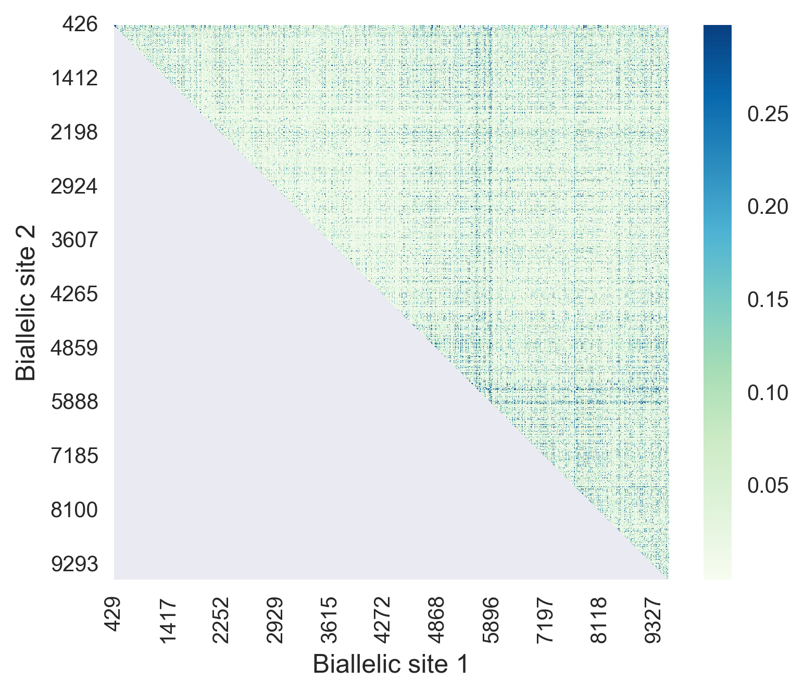

##Extensive divergence makes sitewise measures of genetic linkage ineffective  
For pairs of biallelic sites (ignoring rare variants), R^2 was used to estimate how strongly the allele in one site predicts the allele in the second site, with values of 0 indicating no linkage and 1 indicating perfect linkage. The mean value of R^2 was 0.044, indicating very low levels of linkage overall.
