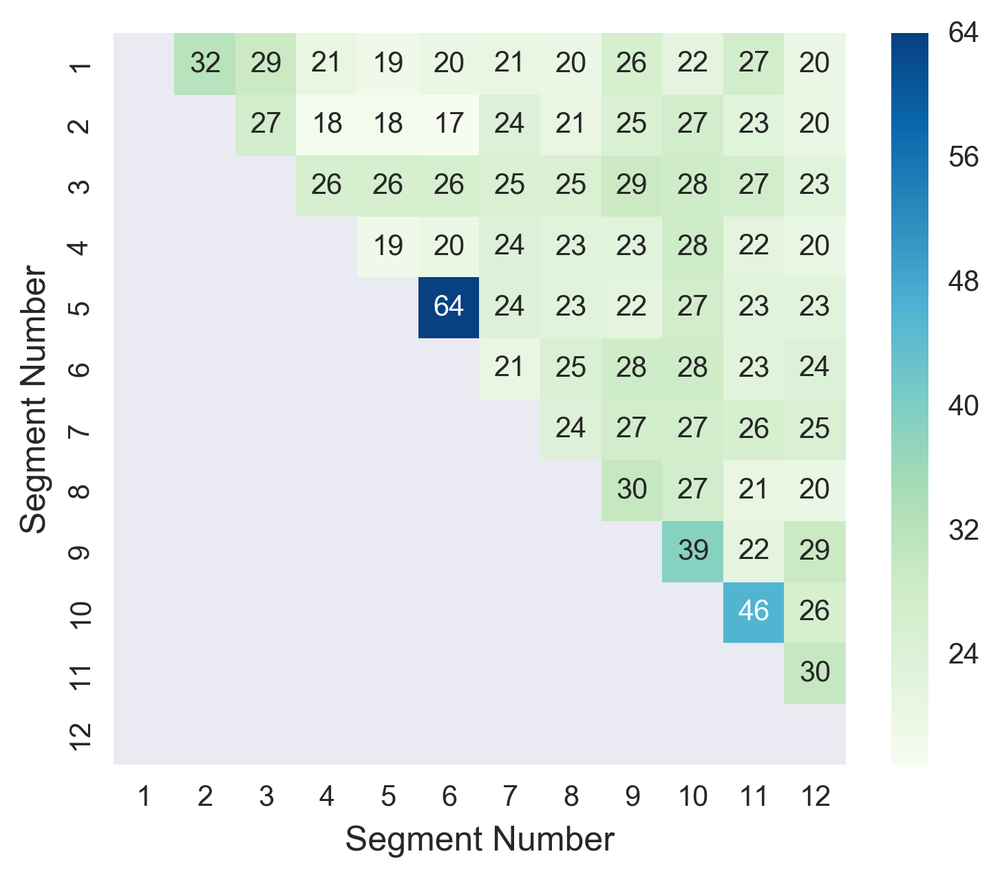

## Figure S2: No evidence of linkage between nonadjacent segments of the SIV genome.
The alignment used for GARD analyses (LANL compendium with HIV overrepresentation reduced) was split along the breakpoints identified by GARD to yield the 12 genomic segments, and a maximum likelihood tree was constructed for each. The number of steps required to turn one tree topology into another was assessed for each pair of trees with the Rooted Subtree-Prune-and-Regraft (rSPR) package. Segment pairs with similar topologies have lower scores than segments with less similar topologies.
